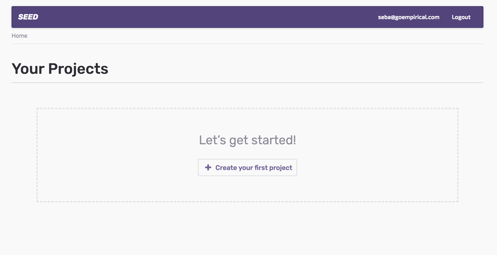
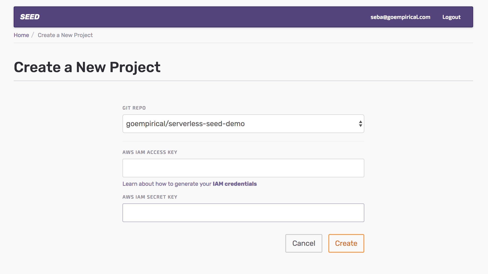
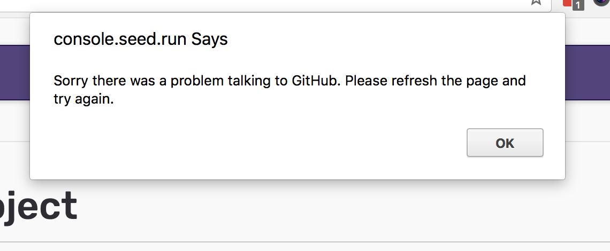
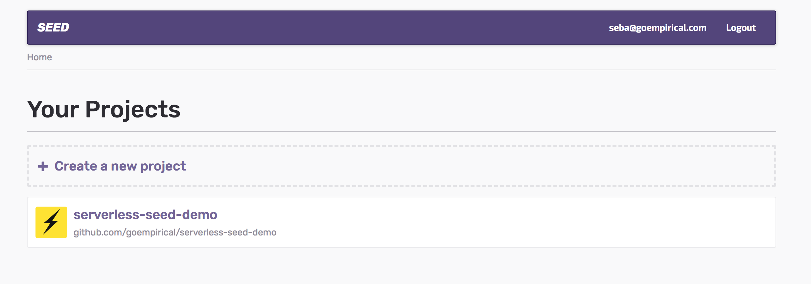

#Steps

1 - Go to https://seed.run/.

2 - Create a free account if you do not have one yet

3 - Login with your credentials

4 - You will see the following screen

5 - Create a project

Note: If the repo is still empty you will get a popup message saying something went wrong. We will talk to SEED maybe we can add a better message

6 - Project now has been created!

7 - You are ready to go. For more info go to SEED docs here: https://seed.run/docs/
